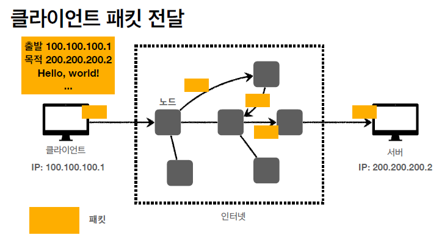

# 모든 개발자를 위한 HTTP 웹 기본 지식

## 인터넷 네트워크

<ul>
    <li>클라이언트와 서버가 통신할때 인터넷을 통해 통신해야 한다면 어떻게 해야할까?</li>
    <li>그러면 어떤 규칙과 어떤 방식을 통해 데이터를 주고 받을까?</li>
</ul>

### IP(Internet protocol)

<ul>
    <li>지정한 IP 주소에 데이터 전달</li>
    <li>패킷 이라는 통신 단위로 데이터 전달</li>
</ul>
패킷을 전달하는 과정(ip 패킷) 
<ol>
    <li>출발지 ip와 목적지 ip 패킷에 입력</li>
    <li>패당 패킷에 전달할 데이터 입력</li>
    <li>ip protocol에 의해서 데이터 전달  </li>
        <ul>
        <li>이때 노드간의 데이터 전송이 지속적으로 이루어 진다</li>
        <li>request할때의 데이터를 전송받는 노드들과 response할때 데이터를 전달받는 노드들은 다를 수 있다.</li>
        </ul>
</ol>

<b>ip protocol의 문제점</b>
<ul>
    <li>비 연결성 : 패킷을 받을 대상이 없어도 데이터는 전송한다.</li>
    <li>비 신뢰성 : 패킷이 중간에 사라질 가능성, 패킷이 보내진 순서대로 오지 않을 가능성이 있다.</li>
    <li>프로그램 구분 : 같은 ip를 사용하는 서버에서 통신하는 애플리케이션이 둘 이상이면? 
    ->음악을 들으며 게임을 하는 상황에 어떤 패킷이 음악에 필요한 패킷인지</li>
</ul>
