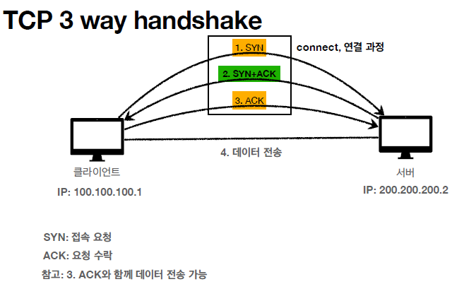

# 모든 개발자를 위한 HTTP 웹 기본 지식

## 인터넷 네트워크

<ul>
    <li>클라이언트와 서버가 통신할때 인터넷을 통해 통신해야 한다면 어떻게 해야할까?</li>
    <li>그러면 어떤 규칙과 어떤 방식을 통해 데이터를 주고 받을까?</li>
</ul>

### IP(Internet protocol)

<ul>
    <li>지정한 IP 주소에 데이터 전달</li>
    <li>패킷 이라는 통신 단위로 데이터 전달</li>
</ul>
패킷을 전달하는 과정(ip 패킷) 
<ol>
    <li>출발지 ip와 목적지 ip 패킷에 입력</li>
    <li>패당 패킷에 전달할 데이터 입력</li>
    <li>ip protocol에 의해서 데이터 전달  </li>
        <ul>
        <li>이때 노드간의 데이터 전송이 지속적으로 이루어 진다</li>
        <li>request할때의 데이터를 전송받는 노드들과 response할때 데이터를 전달받는 노드들은 다를 수 있다.</li>
        </ul>
</ol>

<b>ip protocol의 문제점</b>
<ul>
    <li>비 연결성 : 패킷을 받을 대상이 없어도 데이터는 전송한다.</li>
    <li>비 신뢰성 : 패킷이 중간에 사라질 가능성, 패킷이 보내진 순서대로 오지 않을 가능성이 있다.</li>
    <li>프로그램 구분 : 같은 ip를 사용하는 서버에서 통신하는 애플리케이션이 둘 이상이면? 
    ->음악을 들으며 게임을 하는 상황에 어떤 패킷이 음악에 필요한 패킷인지</li>
</ul>

### TCP,UDP

#### 프로토콜 계층

#### TCP/IP 패킷 정보

#### TCP 특징

<ul>
    <li>
        

            연결지향 : 3 way hand handshake
            
        

    </li>
    <li>
        

            데이터 전달 보증
            
        

    </li>
    <li>
        

            순서 보장
            
        

    </li>
<li>신뢰할 수 있음</li>
<li>조금은 느림</li>
</ul>

#### UDP

<ul>
    <li>3 way handshake를 하지 않기 때문에 빠르지만 연결지향적이지 않다.</li>
    <li>IP와 거의 같다 + port + 체크섬</li>
    <li>애플리케이션에서 추가 작업 필요</li>
</ul>

### Port

<pre>
한번에 둘 이상 연결하려면 어떻게 해야 할까?
하나의 클라이언트가 두개의 서버에 연결한다면 서버는 하나의 IP에 데이터를 보내기만 하면된다.
하지만 클라이언트는 어떤 데이터가 어떤 어플리케이션에 사용하는 데이터인지 구분해야 한다.
이때 이용하는 것이 port를 사용하는 것이다.
</pre>

### DNS

<pre>
naver에 접근하려면 naver의 ip를 알아야 한다.
근데 매번 ip를 찾기도 힘들고 외우기도 힘들다.
DNS는 naver.com과 naver의 서버 IP를 mapping 되어 있는 시스템으로서,
우리가 naver에 접근할때 ip를 찾아주는 시스템이다.</pre>

## URI와 웹 브라우저 요청 흐름

### URI

<ul>
    <li>URI : Resource Identifier : 자원의 위치 + 자원의 이름</li>
    <li>URL : Resource Locator : 자원의 위치를 지정 </li>
    <li>URN : Resource Name : 자원의 이름를 부여 </li>
    <ul>
    <li>URN 이름만으로 실제 리소스를 찾을 수 있는 방법이 보편화 되지 않음. </li>
    </ul>
</ul>

#### URL 전체 문법

<pre>
scheme://[userinfo@]host[:port][/path][?query][#fragment]
https://www.google.com:443/search?q=hello&hl=ko
</pre>

<ul>
    <li>scheme</li>
        <ul>
        <li>주로 프로토콜을 사용</li>
        </ul>
    <li>userinfo@</li>
        <ul>
        <li>URL에 사용자 정보를 포함해서 인증</li>
        <li>거의 사용하지 않음</li>
        </ul>
    <li>Host</li>
        <ul>
        <li>호스트명</li>
        <li>도메인명 또는 IP 주소를 직접 사용가능</li>
        </ul>
    <li>Port</li>
        <ul>
        <li>접속 포트</li>
        </ul>
    <li>Path</li>
        <ul>
        <li>리소스 경로, 계층적 구조로 이뤄져 있음</li>
        </ul>
    <li>쿼리스트링</li>
        <ul>
        <li>key value 의 형태로 데이터를 전송</li>
        </ul>
    <li>fragment</li>
        <ul>
        <li>html의 내부 북마크 같은 곳에 사용함</li>
        <li>서버에 데이터를 전송하지는 않음</li>
        </ul>
</ul>

### 브라우저 요청 흐름
<ol>
    <li>DNS를 이용해서 IP,Port 찾기</li>
    <li>http 요청 메시지 생성</li>
    <li>socket 라이브러리로 3way handshake 진행</li>
    <li>TCP/IP계층에서 패킷으로 인코딩</li>
    <li>서버로 데이터 전송</li>
    <li>도착한 요청 패킷 디코딩</li>
    <li>요청한 데이터를 찾아서 http 응답 메시지 생성</li>
    <li>패킷으로 인코딩</li>
    <li>클라이언트에게 전송</li>
</ol>

