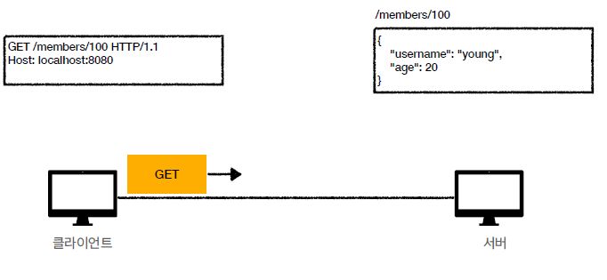
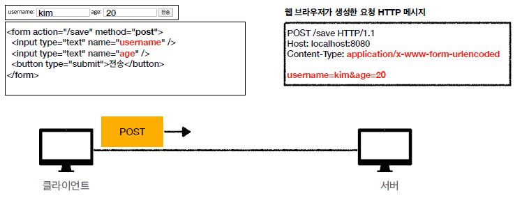
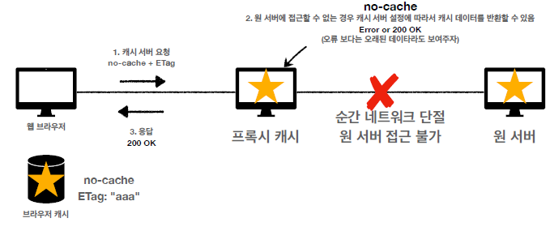

# 모든 개발자를 위한 HTTP 웹 기본 지식

## 인터넷 네트워크

<ul>
    <li>클라이언트와 서버가 통신할때 인터넷을 통해 통신해야 한다면 어떻게 해야할까?</li>
    <li>그러면 어떤 규칙과 어떤 방식을 통해 데이터를 주고 받을까?</li>
</ul>

### IP(Internet protocol)

<ul>
    <li>지정한 IP 주소에 데이터 전달</li>
    <li>패킷 이라는 통신 단위로 데이터 전달</li>
</ul>
패킷을 전달하는 과정(ip 패킷) 
<ol>
    <li>출발지 ip와 목적지 ip 패킷에 입력</li>
    <li>패당 패킷에 전달할 데이터 입력</li>
    <li>ip protocol에 의해서 데이터 전달</li>
        <ul>
            <li>이때 노드간의 데이터 전송이 지속적으로 이루어 진다</li>
            <li>request할때의 데이터를 전송받는 노드들과 response할때 데이터를 전달받는 노드들은 다를 수 있다.</li>
        </ul>
</ol>

<b>ip protocol의 문제점</b>
<ul>
    <li>비 연결성 : 패킷을 받을 대상이 없어도 데이터는 전송한다.</li>
    <li>비 신뢰성 : 패킷이 중간에 사라질 가능성, 패킷이 보내진 순서대로 오지 않을 가능성이 있다.</li>
    <li>프로그램 구분 : 같은 ip를 사용하는 서버에서 통신하는 애플리케이션이 둘 이상이면?
    ->음악을 들으며 게임을 하는 상황에 어떤 패킷이 음악에 필요한 패킷인지</li>
</ul>

### TCP,UDP

#### 프로토콜 계층

#### TCP/IP 패킷 정보

#### TCP 특징

<ul>
    <li>
        

            연결지향 : 3 way hand handshake
            
        

    </li>
    <li>
        

            데이터 전달 보증
            
        

    </li>
    <li>
        

            순서 보장
            
        

    </li>
<li>신뢰할 수 있음</li>
<li>조금은 느림</li>
</ul>

#### UDP

<ul>
    <li>3 way handshake를 하지 않기 때문에 빠르지만 연결지향적이지 않다.</li>
    <li>IP와 거의 같다 + port + 체크섬</li>
    <li>애플리케이션에서 추가 작업 필요</li>
</ul>

### Port

<pre>
한번에 둘 이상 연결하려면 어떻게 해야 할까?
하나의 클라이언트가 두개의 서버에 연결한다면 서버는 하나의 IP에 데이터를 보내기만 하면된다.
하지만 클라이언트는 어떤 데이터가 어떤 어플리케이션에 사용하는 데이터인지 구분해야 한다.
이때 이용하는 것이 port를 사용하는 것이다.
</pre>

### DNS

<pre>
naver에 접근하려면 naver의 ip를 알아야 한다.
근데 매번 ip를 찾기도 힘들고 외우기도 힘들다.
DNS는 naver.com과 naver의 서버 IP를 mapping 되어 있는 시스템으로서,
우리가 naver에 접근할때 ip를 찾아주는 시스템이다.</pre>

## URI와 웹 브라우저 요청 흐름

### URI

<ul>
    <li>URI : Resource Identifier : 자원의 위치 + 자원의 이름</li>
    <li>URL : Resource Locator : 자원의 위치를 지정 </li>
    <li>URN : Resource Name : 자원의 이름를 부여 </li>
    <ul>
        <li>URN 이름만으로 실제 리소스를 찾을 수 있는 방법이 보편화 되지 않음. </li>
    </ul>
</ul>

#### URL 전체 문법

<pre>
scheme://[userinfo@]host[:port][/path][?query][#fragment]
https://www.google.com:443/search?q=hello&hl=ko
</pre>

<ul>
    <li>scheme</li>
        <ul>
            <li>주로 프로토콜을 사용</li>
        </ul>
    <li>userinfo@</li>
        <ul>
            <li>URL에 사용자 정보를 포함해서 인증</li>
            <li>거의 사용하지 않음</li>
        </ul>
    <li>Host</li>
        <ul>
            <li>호스트명</li>
            <li>도메인명 또는 IP 주소를 직접 사용가능</li>
        </ul>
    <li>Port</li>
        <ul>
            <li>접속 포트</li>
        </ul>
    <li>Path</li>
        <ul>
            <li>리소스 경로, 계층적 구조로 이뤄져 있음</li>
        </ul>
    <li>쿼리스트링</li>
        <ul>
            <li>key value 의 형태로 데이터를 전송</li>
        </ul>
    <li>fragment</li>
        <ul>
            <li>html의 내부 북마크 같은 곳에 사용함</li>
            <li>서버에 데이터를 전송하지는 않음</li>
        </ul>
</ul>

### 브라우저 요청 흐름
<ol>
    <li>DNS를 이용해서 IP,Port 찾기</li>
    <li>http 요청 메시지 생성</li>
    <li>socket 라이브러리로 3way handshake 진행</li>
    <li>TCP/IP계층에서 패킷으로 인코딩</li>
    <li>서버로 데이터 전송</li>
    <li>도착한 요청 패킷 디코딩</li>
    <li>요청한 데이터를 찾아서 http 응답 메시지 생성</li>
    <li>패킷으로 인코딩</li>
    <li>클라이언트에게 전송</li>
</ol>

## http의 기본
### 클라이언트 서버 구조 특징
<ul>
    <li>* 각각 독립적으로 구조화 되어 있기 때문에 클라이언트, 서버 내부적으로 변경에 용이함</li>
    <li>Request Response 구조</li>
    <li>클라이언트는 서버에 요청을 보내고, 응답을 대기</li>
    <li>서버가 요청애 대한 결과를 만들어서 응답</li>
</ul>

### stateful , stateless
<ul>
    <li>stateful : 서버가 클라이언트의 상태를 보존하는 것</li>    
    <li>stateless : 서버가 클라이언트의 상태를 보존하지 않는것</li>    
        <ul>
            <li>무상태는 응답 서버를 쉽게 바꿀수 있다 == 무한한 서버 증설이 가능하다 </li>
            <li>서버가 분리 되어 있는 경우 서버 1이 장애가 나는 경우 다른 서버로 클라이언트의 요청을 전달 할 수 있다.</li>
        </ul>
</ul>

#### 실무의 한계
<ul>
    <li>모든것을 무상태로 설계할 수 있는 경우도 있고 아닌경우도 있다.</li>
        <ul>
            <li>무상태 : 정적페이지, 로그인이 필요없는 단순한 서비스 소개 화면</li>
            <li>상태 유지 : 로그인 이후 화면 </li>
        </ul>
    <li>로그인 한 사용자의 경우 로그인 정보를 서버에 유지</li>
    <li>상태 유지는 일반적으로 쿠키와 세션을 사용해서 상태유지한다</li>
    <li>상태 유지 최소한만 사용</li>
</ul>

### 비연결성

<pre>
연결을 유지하게 되면 하나의 서버가 많은 클라이언트와 연결되어 있음으로 서버에 부하가 걸린다.
이를 방지하기 위해서 http는 연결을 유지하지 않는다.
이는 양날의 검으로 작용하는데 장점으로는 서버의 자원을 효율적으로 사용할 수 있지만,
서버와 다시 연결한다고 하면 3 way handshake를 다시 진행해야 하며, 추가적으로 많은 파일을 다시 받아야 한다.
이를 해결하기 위해서 persistent connections로 문제를 해결한다.
</pre>

### HTTP Message
#### HTTP 메시지 구조

<ul>
    <li>request</li>
        <ul>
            start-line
            <li>http method : 서버가 수행해야 할 동작 지정 GET, POST, PUT, DELETE</li>
            header            
            <li>요청 대상 : 절대경로= "/"로 시작하는 경로</li>
            <li>HTTP VERSION</li>
        </ul>
    <li>response</li>
        <ul>
            start-line
            <li>http 버전</li>
            <li>http 상태코드 : 성공여부   200, 400, 500</li>
            header
            <li>인코딩 방식</li>
            <li>필요시 임의의 header 추가 가능</li>
            body
            <li>실제 전송할 테이더 </li>
            <li>html, json, 영상 ,image등등 전부 가능</li>
        </ul>
</ul>

## HTTP Method
<ul>
    <li>GET : 리소스 조회</li>
    <li>POST : 요청 데이터 처리, 등록</li>
    <li>PUT : 리소스를 대체, 리소스가 없으면 생성</li>
    <li>PATCH : 리소스를 부분 변경</li>
    <li>DELETE : 삭제</li>
</ul>

### HTTP API를 만들어 보자.
#### 리소스와 행위를 분리
<ul>
    <li>URI는 리소스만 식별</li>
    <li>리소스와 해당 리로스를 대상으로 하는 행위를 분리</li>
    <ul>
        <li> 리소스 : 회원</li>
        <li> 행위 : 등록,수정,삭제,조회</li>
    </ul>
</ul>

### GET,POST
#### GET
<ul>
    <li>리소스 조회</li>
    <li>서버에 전달하고 싶은 데이터를 query string을 통해서 전달</li>
    <li>메시지 바디를 사용해서 전달할 수 있지만 지원하지 않는 곳이 많아서 권장하지 않는다.</li>
</ul>

##### GET 과정
<ol>
    <li></li>
    <li></li>
    <li></li>
</ol>

#### POST

<ul>
    <li>요청 데이터 처리</li>
    <li>메시지 바디를 통해 서버로 요청 데이터 전달</li>
    <li>서버는 요청 데이터를 처리</li>
    <ul>
        <li>메시지 바디를 통해 들어온 데이터를 처리하는 모든 기능을 수행</li>
    </ul>
    <li>주로 전달된 데이터로 신규 리소스 등록, 프로세스 처리에 사용</li>
</ul>

##### POST의 과정
<ol>
    <li></li>
    <li></li>
    <li></li>
</ol>

##### POST의 역활
<ul>
    <li>새 리소스 등록</li>
    <li>요청 데이터 처리</li>
    <ul>
        <li>프로세스 로직의 동작</li>
        <li>결과로 데이터가 생성되지 않는 경우가 있을 수 있다</li>
    </ul>
    <li>다른 메서드로 처리하기 어려운 경우</li>
    <ul>
        <li>JSON으로 조회 해야 하는데 GET을 사용하기 어려울 때</li>
        <li>애매하면 POST</li>
    </ul>
</ul>

#### PUT
<ul>
    <li>리소스를 대체, 덮어 씌워짐. 즉, 기존 리소스를 삭제하고 새로운 리소스를 넣는다.</li>
    <ul>
        <li>리소스가 있으면 대체</li>
        <li>리소스가 없으면 생성</li>
    </ul>
    <li>클라이언트가 리소스의 위치를 알고 지정</li>
</ul>

##### PUT의 역활
###### 리소스가 있는 경우
<ol>
    <li></li>
    <li></li>
</ol>

###### 리소스가 없는 경우
<ol>
    <li></li>
    <li></li>
</ol>

###### 리소스가 있는데 일부 데이터만 보내는 경우
<ol>
    <li></li>
    <li></li>
</ol>

#### PATCH
<ul>
    <li>리소스를 부분 변경</li>
</ul>

#### DELETE
<ul>
    <li>리소스를 삭제</li>
</ul>

### HTTP 메서드의 속성

#### 안전
<ul>
    <li>호출해도 리소스를 변경하지 않는다.</li>
</ul>

#### 멱등
<ul>
    <li>여러번 호출하든 결과는 같아야 한다.</li>
    <li>멱등 메서드</li>
    <ul>
        <li>GET : 여러번 조회해도 같은 결과가 조회된다.</li>
        <li>PUT : 결과를 대체한다.따라서 같은 요청을 여러번 해도 최종 결과는 같다.</li>
        <li>DELETE : 결과를 삭제한다. 따라서 같은 요청을 여러번 하면 삭제된 결과로 같다.</li>
        <li style="color: red">POST : 두번 호출하면 같은 결제가 중복해서 발생할 수 있다. 즉, 멱등하지 않다. </li>
    </ul>
</ul>

##### 멱등이 필요한 이유
<ul>
    <li>자동 복구 메커니즘</li>
    <li>서버가 정상적으로 동작하지 않았을때, 동일한 요청을 보내도 되는가?</li>
</ul>

#### 캐시가능
<ul>
    <li>응답 결과 리소스를 캐시해서 사용해도 되는가?</li>
    <li>GET,POST,HEAD,PATCH 캐시가능</li>
    <li>실제로는 GET,HEAD만 캐시로 사용한다</li>
</ul>

## HTTP 매서드의 활용
### 클라이언트에서 서버로 데이터 전송
<ol>
    <li>정적 데이터를 조회 : ex) /static/star.jpg</li>
    <li>동적 데이터를 조회 : ex) /search?id=100&p=3&lang=ko</li>
    <li>HTML Form 데이터 전송 :  </li>
<ul>
    <li>application/x-www-form-urlencoded : form data 한번에 전송. </li>
    <li>Multipart/form-date : 파일과 같은 바이너리 데이터를 전송시 사용</li>
</ul>
</ol>

### HTTP API 설계 예시

[//]: # (#### 회원관리 API 설계)

[//]: # (<ul>)

[//]: # (    <li>회원 목록 : /members -> GET</li>)

[//]: # (    <li>회원 등록 : /members -> POST</li>)

[//]: # (    <li>회원 조회 : /members/{id} -> GET</li>)

[//]: # (    <li>회원 수정 : /members/{id} -> PATCH,PUT,POST</li>)

[//]: # (    <li>회원 삭제 : /members/{id} -> DELETE</li>)

[//]: # (</ul>)

#### POST - 신규 자원 등록의 특징
<ul>
    <li>클라이언트는 등록될 리소스의 URI를 모른다</li>
    <li>새로운 리소스가 등록되면 URI를 생성해준다.</li>
    <li>location을 통해 새로 등록된 URI를 확인할 수 있다. </li>
    <li>컬렉션</li>
    <ul>
        <li>서버가 관리하는 리소스 디렉토리</li>
        <li>서버가 리소스의 URI를 생성하고 관리</li>
        <li>컬렉션은 /members가 된단</li>
    </ul>
</ul>

#### PUT - 신규 자원 등록의 특징
<ul>
    <li>클라이언트가 리소스의 URI를 알고 있어야 한다.</li>
    <ul>
        <li>파일 등록 /files/{filename} -> put</li>
        <li>PUT /files/stars.jpg </li>
    </ul>
    <li>클라이언트가 직접 리소스의 URI를 지정한다.</li>
    <li>스토어</li>
    <ul>
        <li>클라이언트가 관리하는 리소스 저장소</li>
        <li>클라이언트가 리소스의 URI를 알고 관리</li>
        <li>스토어는 /files가 된다</li>
    </ul>
</ul>

#### HTML FORM 사용
<ul>
    <li>HTML FORM은 GET과 POST만 사용할 수 있다.</li>
    <li>따라서 DELETE를 할때에는 controll URI를 사용해야 한다.</li>
    <ul>
        <li>/new,/delete,/edit</li>
    </ul>
</ul>

## HTTP 상태코드
### 상태코드
<ul>
    <li>1xx(Informational) : 요청이 수신되어 처리중</li>
    <li>2xx(Successful) : 요청 정상 처리</li>
    <li>3xx(Redirection) : 요청을 완료하려면 추가적인 행동이 필요함</li>
    <li>4xx(Client Error) : 클라이언트 오류, 잘못된 방법으로 서버가 요청을 처리할 수 없음</li>
    <li>5xx(Server Error) : 서버 오류, 서버가 정상적으로 요청을 처리 하시 못함</li>
</ul>

#### 2xx - success
<ul>
    <li>200 OK</li>
        <ul>
            <li></li>
        </ul>
    <li>201 Created</li>
        <ul>
            <li></li>
        </ul>
    <li>202 Accepted</li>
        <ul>
            <li>요청이 접수되었으나 처리가 완료되지 않았음.</li>
            <li>배치 처리 같은 곳에소 사용.</li>
            <li>에) 요청 접수 후 1시간 뒤에 배치 프로세스가 요청을 처리함.</li>
        </ul>
    <li>204 No Content</li>
        <ul>
            <li>서버가 성공적으로 동작했지만 응답 페이로드 본문에 보낼 데이터가 없음.</li>
            <li>save 버튼의 결과로 아무 내용도 없어도 될때.</li>
            <li>save 버튼을 눌러도 같은 화면을 유지해야 한다.</li>
        </ul>
</ul>

#### 3xx - redirection
300번 응답에 location이 있으면 자동으로 redirect 된다
<li></li>
<ul>
    <li>영구 리다이렉션: 특정 리소스의 URI가 영구적으로 이동 -> 301, 308</li>
    <li>일시 리다이렉션: 일시적인 변경 -> 302, 307, 303</li>
    <li>특수 리다이렉션: 결과 대신 캐시를 사용</li>
</ul>
<ul>
    <li>300 Multiple Choices</li>
    <li>301 Moved Permanently</li>
    <ul>
        <li></li>
        <li>본문이 제거 될 수 있음 == 뒤로가기를 하면 redirect되기 때문에 get을 계속해서 불러옴</li>    
    </ul>    
    <li>302 Found</li>
    <ul>
        <li>리다이렉트시 요청 메서드가 GET으로 변하고, 본문이 제거될 수 있음</li>
    </ul>
    <li>303 See Other</li>
    <ul>
        <li>302와 기능은 같음</li>
        <li>리다이렉트시 요청 메서드와 본문유지(요청 메서드는 절대 변경하면 안된다.)</li>
    </ul>
    <li>304 Not Modified</li>
    <ul>
        <li>캐시를 목적으로 사용</li>
        <li>클라이언트에게 리소스가 수정되지 않았음을 알려준다.따라서 클라이언트는 로컬 PC에 저장된 캐시를 재사용한다.</li>
        <li>304 응답은 응답에 메시지 바디를 포함하면 안된다.(로컬 캐시 하용하니까)</li>
        <li>조건부 GET,HEAD 요청시 사용</li>
    </ul>
    <li>307 Temporary Redirect</li>
    <ul>
        <li>302와 기능은 같음</li>
        <li>리다이렉트시 요청 메서드가 GET으로 변경</li>
    </ul>
    <li>308 Permanent Redirect</li>
    <ul>
        <li></li>
        <li>본문이 제거되지 않음 == 새로고침을 하면 같은 본문이 중복적으로 날라감</li>
    </ul>       
</ul>

##### PRG pattern

<ul>
    <li>POST로 주문후에 새로 고침으로 인한 중복 주문 방지</li>
    <li>POST로 주문후에 주문 결과를 GET으로 메서드로 리다이렉트</li>
    <li>새로고침해도 결과 화면을 GET으로 조회</li>
    <li>중복 주문 대신에 결과 화면만 GET으로 다시 요청</li>
</ul>

### 4xx - 클라이언트 오류, 5xx - 서버 오류
#### 4xx
<ul>
    <li>클라이언트의 요청에 잘못된 문법등으로 서버가 요청을 수행할 수 없음</li>
    <li>오류의 원인이 클라이언트에 있음</li>
    <li>클라이언트가 이미 잘못된 요청, 데이터를 보내고 있기 때문에, 똑같은 재시도가 실패함</li>
</ul>
<ul>
    <li>400 Bad Request</li>
    <ul>
        <li>요청구문, 메시지 등등 오류</li>
        <li>클라이언트는 요청을 내용을 다시 검토하고 보낸다</li>
    </ul>
    <li>401 Unauthorized</li>
    <ul>
        <li>인증되지 않음</li>
        <li>401 오류 발생시 응답에 WWW-Authenticate 헤더와 함께 인증 방법을 설명</li>
    </ul>
    <li>403 Forbidden</li>
    <ul>
        <li>서버가 요청을 이해했지만 승인 거부</li>
        <li>주로 인증은 되지만 인가가 안될때 사용</li>
    </ul>
    <li>404 Not Found</li>
    <ul>
        <li>요청 리소스를 찾을 수 없음</li>
        <li>클라이언트가 권한이 부족한 리소스에 접근했을때 403 대신 사용</li>
    </ul>
</ul>

#### 5xx
<ul>
    <li>서버 문제로 오류 발생</li>
    <li>재시도 하면 성공할 수 있음</li>
</ul>
<ul>
    <li>500 Internal Server Error</li>
    <ul>
        <li>서버 문제로 오류 발생</li>
    </ul>    
    <li>503 Service Unavailable</li>
    <ul>
        <li>서비스 이용 불가</li>
        <li>서버가 일시적인 과부하 및 예정된 작업으로 잠시 요청을 처리할 수 없음</li>
    </ul>
</ul>

## HTTP 헤더 - 일반 헤더
### HTTP 헤더 개요 

<ul>
    <li>메시지 본문을 통해 표현 데이터 전달</li>
    <li>메시지 본문 = 페이로드</li>
    <li>표현은 요청이나 응답에서 전달할 실제 데이터</li>
    <li>표현 헤더는 표현 데이터를 해석할 수 있는 정보 제공 -> 데이터 유형(html, json), 데이터 길이, 압축 정보 등등</li>
</ul>

### 표현
<ul>
    <li>Content-Type: 표현 데이터의 형식</li>
    <ul>
        <li>미디어 타입, 문자 인코딩</li>
    </ul>
    <li>Content-Encoding: 표현 데이터의 압축방식</li>
    <ul>
        <li>표현 데이터를 압축하기 위해 사용</li>
        <li>데이터를 전달하는 곳에서 압축 후 인코딩 헤더 추가</li>
        <li>데이터를 읽는 쪽에서 인코딩 헤더의 정보로 압축 해재</li>
    </ul>
    <li>Content-Language: 표현 데이터의 자연언어</li>
    <ul>
        <li>표현 데이터의 자연 언어를 표현</li>
    </ul>
    <li>Content-Length: 표현 데이터의 길이</li>
    <ul>
        <li>바이트 단위</li>
        <li>Transfer-Encoding(전송 코딩)을 사용하면 Content-Length를 사용하면 안됨 : Transfer-Encoding안에 정보가 들어가 있음</li>
    </ul>
</ul>

#### 콘텐츠 협상
※ 클라이언트가 선호하는 형식으로 콘텐츠를 받을 수 있도록 우선순위를 정해서 요청하는 방법

<ul>
    <li>Accept: 클라이언트가 선호하는 미디어 타입 전달</li>
    <li>Accpet-Charset : 클라이언트가 선호하는 문자 인코딩</li>
    <li>Accpet-Encoding : 클라이언트가 선호하는 압축 인코딩</li>
    <li>Accpet-Language : 클라이언트가 선호하는 자연언어 </li>
</ul>

##### 협상과 우선순위1
<ul>

    <li>Quality Values 값 사용</li>
    <li>0~1,사이의 값으로 클 수록 우선순위가 높다</li>
    <li>생략하면 1이다.</li>
</ul>

##### 협상과 우선순위2
<ul>
    <li>구체적인 것이 우선한다.</li>
</ul>

##### 협상과 우선순위3
<ul>
    <li>구체적인 것을 기준으로 미디어 타입을 맞춘다</li>
    <li>Accept: text/*q=0.3, text/html;q=0.7,text/html;level=1,text/html;level=2;q=0.4,*/*;q=0.5</li>
    
</ul>

### 전송방식
<ul>
    <li>단순 전송</li>
    <ul>
        <li></li>
    </ul>
    <li>압축 전송</li>
    <ul>
        <li></li>
        <li>content-encoding을 통해 어떻게 압축 되었는지 확인할수 있도록 한다</li>
    </ul>
    <li>분할 전송</li>
    <ul>
        <li></li>
        <li>5를 보내면 5만큼의 데이터를 받고 다시 5를 보내면 이후 5만큼의 데이터를 받는다</li>
    </ul>
    <li>범위 전송</li>
    <ul>
        <li></li>
    </ul>
</ul>

### 일반 정보
<ul>
    <li>From</li>
    <ul>
        <li>유저 에이전트의 이메일 정보</li>
        <li>일반적으로 잘 사용되지 않음.</li>
        <li>검색 엔진 같은 곳에서 주로 사용</li>
        <li>요청에서 사용</li>
    </ul>
    <li>Referer</li>
    <ul>
        <li>이전 웹 페이지의 주소</li>
        <li>현재 요청된 페이지의 이전 웹 페이지 주소</li>
        <li>A->B로 이동하는 경우 B를 요청할 때 Referer:a 를 포함해서 요청</li>
        <li>Referer를 통해서 유입경로 분석 가능</li>
        <li>요청에서 사용</li>
    </ul>
    <li>User Agent</li>
    <ul>
        <li>유저 애플리케이션 정보</li>
        <li>클라이언트의 애플리에키션의 정보(웹 브라우저 정보 등등)</li>
        <li>통계 정보</li>
        <li>어떤 종류의 브라우저에서 장애가 발생하는지 파악가능</li>
        <li>요청에서 사용</li>
    </ul>
    <li>Server</li>
    <ul>
        <li>요청을 처리하는 ORIGIN 서버의 소프트웨어 정보</li>
        <li>Server: Apache/2.2.22(Debian)</li>
        <li>server: nginx</li>
        <li>응답에서 사용</li>
    </ul>
    <li>Date</li>
    <ul>
        <li>메시지가 발생한 날짜와 시간</li>
        <li>응답에서 사용</li>
    </ul>
</ul>

### 특별한 정보
<ul>
    <li>Host</li>
    <ul>
        <li>요청한 호스트 정보(도메인)</li>
        <li>요청에서 사용</li>
        <li>필수</li>
        <li>하나의 서버가 여러 도메인을 처리할때</li>
        <li>하나의 IP주소에 여러 도메인이 적용되어 있을 때</li>
        <li></li>
    </ul>
    <li>Location</li>
    <ul>
        <li>페이지 리다이렉션</li>
        <li>300대 응답에 location이 있으면 자동으로 redirect</li>
        <li>201의 location 값은 요청에 의해 생성된 리소스 URI</li>
        <li>300대 location 값은 요청을 자동으로 redirect 하기위한 대상 리소스를 가리킴</li>
    </ul>
    <li>Allow</li>
    <ul>
        <li>허용 가능한 HTTP 메서드</li>
        <li>405에서 응답에 포함해야한다.</li>
        <li>405응답에 보면 가능한 메서드를 알려주는 헤더정보라고 할 수 있다.</li>
    </ul>
    <li>Retry-after</li>
    <ul>
        <li>유저 에이전트가 다음 요청을 하기까지 기다려야 하는 시간</li>
        <li>503과 같은 서비스 이용 불가할때</li>
    </ul>
</ul>

### 인증
<ul>
    <li>Authorization</li>
    <ul>
        <li>클라이언트 인증 정보를 서버에 전달</li>
    </ul>
    <li>WWW-Authenticate</li>
    <ul>
        <li>리소스 접근시 필요한 인증 방법 정의</li>
        <li>401 Unauthorized 응답과 함께 사용</li>
    </ul>
</ul>

### 쿠키
<ul>
    <li>Set-Cookie : 서버에서 클라이언트로 쿠키 전달(응답)</li>
    <li>Cookie : 클라이언트가 서버에서 받은 쿠키를 저장하고,HTTP 요청시 서버로 전달</li>
</ul>

#### 쿠키가 동작하는 과정
<ol>
    <li>로그인 요청을 보내면 서버가 쿠키를 생성해서 응답으로 보냄</li>
    <li>브라우저 내부에 쿠키 저장소에 응답으로 받은 쿠키를 저장</li>
    <li>이후 브라우저는 요청을 할때마다 쿠키가 있는지 확인을 하고 해당 쿠기를 같이 요청으로 보냄</li>
    <li>서버는 해당 쿠키로 상태를 알수 있다.</li>
</ol>

#### 쿠키의 상세 정보
<ul>
    예) set-cookie:sessionId=test1234; expires=Sat, 26-Dec-2020 00:00:00 GMT; path=/; domain=.google.com; Secure
    <li>사용처</li>
    <ul>
        <li>사용자 로그인 세션 관리 : 서버가 sessionID를 생성하고 DB에 저장, 이후 cookie가 왔을때 해당 ID와 일치하는 값이 있으면 승인</li>
        <li>광고 정보 트래킹</li>
    </ul>
    <li>쿠키 정보는 항상 서버에 전송됨</li>
    <ul>
        <li>네트워크 트래픽 추가 유발</li>
        <li>최소한의 정보만 사용(session id, 인증 토큰)</li>
        <li>서버에 전송하지 않고, 웹 브라우저 내부에 데이터를 저장하고 싶으면 웹 스토리지 사용</li>
    </ul>
    <li>민감한 정보는 저장하면 안됨</li>
</ul>

#### 쿠키의 생명주기
<ul>
    <li>expires를 통해서 만료일을 지정할 수 있다.</li>
    <li>max-age를 통해서 유효시간을 지정할 수 있다. - 0을 통해 쿠키를 삭제할 수 있음</li>
    <li>session cookie : 만료 날짜를 생략하면 브라우저 종료시 까지만 유지</li>
    <li>영속 쿠키 : 만료 날짜를 입력하면 해당 날짜까지 유지</li>
</ul>

#### 쿠키의 도메인
<ul>
    <li>명시: 명시한 문서 기준 도메인 + 서브 도메인 포함</li>
    <li>domain = example.org를 지정해서 쿠키 생성</li>
    <ul>
        <li>example.org와 dev.example.org 접근 가능</li>
    </ul>
    <li>생략: 현재 문서 기준 도메인만 적용</li>
    <li>example.org에서 쿠키를 생성하고 domain 지정을 생략</li>
    <ul>
        <li>example.org에서만 쿠키 접근</li>
        <li>dev.example.org는 쿠키 미접근</li>
    </ul>
</ul>

### 쿠키의 경로
<ul>
    예)path=/home
    <li>해당 경로의 하위 모든 경로는 접근할 수 있음</li>
</ul>

### 쿠키의 보안
<ul>
    <li>Secure</li>
    <ul>
        <li>쿠키는 http,https를 구분하지 않고 전송</li>
        <li>Secure를 적용하면 https인 경우에만 전송</li>
    </ul>
    <li>HttpOnly</li>
    <ul>
        <li>XSS 공격방지</li>
        <li>자바스크립트 접근 불가</li>
        <li>HTTP 전송에만 사용</li>
    </ul>
    <li>SameSite</li>
    <ul>
        <li>XSRF 공격방지</li>
        <li>요청 도메인과 쿠키에 설정된 도메인이 같은 경우만 쿠키 전송</li>
    </ul>
</ul>

## HTTP 헤더2 - 캐시와 조건부 요청
### 캐시 기본 동작
#### 캐시가 없는 경우
<ul>   
    <li>데이터가 변경 되지 않아도 계속 네트워크를 통해서 데이터를 다운로드 받아야 한다.</li>
    <li>인터넷 네트워크는 매우 느리고 비싸다.</li>
    <li>브라우저 로딩 속도가 느리다</li>
    <li>느린 사용자 경험</li>
</ul>

#### 캐시가 있는 경우
<ol>
    <li>요청에 대한 응답을 할때 캐시의 유효시간을 지정한다.</li>
    <li>두번째 요청에서 요청을 보내기 전에 브라우저 캐시를 뒤져서 유효한 캐시가 있는지 확인한다.</li>
    <li>유효한 캐시가 있으면 해당 캐시를 통해 데이터를 사용하고 그렇지 않으면 네트워크를 통해 다시 응답 받는다.</li>
</ol>
<ul>
    <li>네트워크를 사용하지 않아도 된다.</li>
    <li>네트워크 사용량을 줄일 수 있다.</li>
    <li>브라우저 로딩 속도가 빨****라진다.</li>
    <li>빠른 사용자 경험</li>
</ul>

#### 캐시 시간 초과
<ul>
    <li>캐시 유효 시간이 초과하면 서버를 통해 데이터를 다시 조회하고, 캐시를 갱신한다.</li>
    <li>데이터가 만약 같다면 같은 데이터를 내려주기 보다는 유효시간만 다시 셋팅해 주는것으로 재사용이 가능 하도록 만들어 주는 방법을 선택한다.</li>
</ul>

### 검증 헤더와 조건부 요청1
#### 케시 시간 초과

<ol>
    핵심은 Last_modified를 사용해서 해당 데이터의 변겸점이 있는지 확인할수 있도록 한다.
    <li>첫번째 요청에 응답을 할때 헤더에 캐시의 유효시간과 데이터의 마지막 변경을 넣어 응답한다.</li>
    <li>두번째 요청에서 해당 캐시가 유효한지 확인하다.</li>
    <li>이때 캐시에 last-modified가 있는경우 요청 헤더에 last-modified를 붙여서 보낸다.</li>
    <li>서버에서 응답을 할때 last-modified를 확인해서 변경된 것이 없으면 304 Not Modified를 보내는 것으로 유효시간만 갱신해 준다.</li>
</ol>

#### 검증 헤더 추가
<ul>
    <li>캐시 유효 시간이 초과해도, 서버의 데이터가 갱신도지 않으면</li>
    <li>304 Not Modified + 헤더 메타 정보만 응답(바디는 없다)</li>
    <li>클라이언트는 서버가 보낸 응답 헤더 정보로 캐시의 메타 정보를 갱신</li>
    <li>클라이언트는 캐시에 저장되어 있는 데이터를 재활용</li>
    <li>결과적으로 네티워크 다운로드는 발생하지만 용량이 적다.</li>
    <li>굉장히 실용적인 해결책</li>
</ul>

### 검증 헤더와 조건부 요청2
<ul>
    <li>검증 헤더</li>
    <ul>
        <li>캐시 데이터와 서버 데이터가 같은지 검증하는 데이터</li>
        <li>Last-Modified , ETag</li>
    </ul>
    <li>조건부 요청 헤더</li>
    <ul>
        <li>검증 헤더로 조건에 따른 분기</li>
        <li>If-Modified-Since: Last-Modified 사용</li>
        <li>If-None-Match: ETag 사용</li>
        <li>조건이 만족하면 200 ok</li>
        <li>조건이 만족하지 않으면 304 Not-Modified</li>
    </ul>
</ul>

#### Last Modified 
<ol>
    if-Modified-Since: 이후에 데이터가 수정되었으면?
    <li>
        수정 된 경우
    </li>
    <ul>
        <li>if-Modified-Since가 false이기 때문에 304 Not Modieifed를 보낸다</li>
    </ul>
    <li>수정이 안된 경우</li>
    <ul>
        <li>if-Modified-Since가 true이기때문에 200 OK를 보낸다</li>
    </ul>
</ol>

#### 단점
<ul>
    <li>날짜 기반의 로직 사용</li>
    <li>1초 미만 단위로 캐시 조정이 불가능</li>
    <li>날짜 기반의 로직 사용</li>
    <li>데이터를 수정해서 날짜가 다르지만 같은 데이터를 수정해서 데이터 결과가 똑같은 경우</li>
    <li>서버에서 별도의 캐시 로직을 관리하고 싶은 경우</li>
</ul>

#### 주석이나 공백에 변경점이 생겨도 캐시를 유지하도록 하는 경우 (ETag : entity tag)
<ul>
    <li>캐시용 데이터에 임의의 고유한 버전 이름을 달아둠</li>
    <li>데이터가 변경되면 이 이름을 바꾸어서 변경함 (Hash를 다시 생성)</li>
    <li>단순하게 ETag만 보내서 같으면 유지, 다르면 다시 받기</li>
</ul>

##### 작동 방식
<ol>
    <li>첫번째 요청에 응답을 보낼때 ETag를 헤더에 넣어서 응답함</li>
    <li>해당 응답을 브라우즈 캐시에 저장하고 두번째 요청을 함</li>
    <li>두번째 요청에서 캐시가 만료된 경우 해당 캐시의 ETag를 요청 헤더에 넣어서 보냄(if-None-Match라는 헤더 사용)</li>
    <li>서버에서 ETag가 일치하는 지 확인함</li>
    <ul>
        <li>일치하면 if-None-Match가 false임으로 304 Not Modified를 보내는 것으로 유효시간 갱신</li>
        <li>일치하지 않으면 if-None-Match가 true임으로 200 Ok를 보내는 것으로 새로운 캐시 응답</li>
    </ul>
</ol>

##### 정리
<ul>
    <li>단순하게 ETag만 서버에 보내서 같으면 유지, 다르면 다시 받기</li>
    <li>캐시 제어 로직은 서버에서 완전히 관리</li>
    <li>클라이언트는 단순히 이 값을 서버에 제공한다.</li>
</ul>

### 캐시와 조건부 요청 헤더
#### 케시 제어 헤더
<ul>
    <li>Cache-Control: 캐시 제어</li>
    <ul>
        <li>max-age -> 유효기간, 초단위</li>
        <li>no-cache -> 데이터는 캐시해도 되지만, 항상 원(origin) 서버에 검증하고 사용</li>
        <li>no-store -> 데이터에 민감한 정보가 있음으로 저장하면 안됨</li>
        <li>must-revalidate -> 캐시 만료후 최초 조회시 원서버에 검증해야 함</li>
    </ul>
    <li>Pragma: 캐시 제어(하위 호환)</li>
    <ul>
        <li>no-cache : 1.0 하위호환</li>
    </ul>
    <li>Expires: 캐시 유효 기간(하위 호환)</li>
    <ul>
        <li>캐시 만료일을 날짜로 지정</li>
    </ul>
    <ul>검증 헤더</ul>
    <ul>
        <li>ETag : 캐시에 고유한 이름 부여함으로 검증</li>
        <li>last-modified : 캐시가 변경된 시점으로 검증</li>
    </ul>
</ul>

### 캐시 무효화 
<b>확실한 캐시 뮤효화 응답 : Cache-Control:no-cache,no-store,must-revalidate</b>

#### no-cache VS must-revalidate
##### no-cahce의 기본동작

##### 프록시 캐시 설정에 따른 no-cache동작

프록시 캐시와 원 서버의 네트워크가 순간적으로 단절된경우 프록시 캐시가 응답을 하는 설정이 있다. 때문에 200 OK을 응답하는 경우가 있다.

##### must-revalidate를 사용하게 되면?

프록시 캐시와 원서버의 네트워크가 단절된 경우 must-revalidate를 사용하게 되면 504 Gateway TimeOut을 응답한다.

