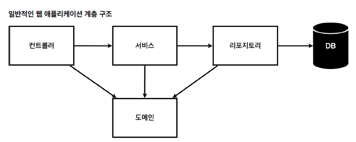

# SpringBootClasses

##프로젝트 환경설정

### spring boot documentation
<a href="srping.io">srping.io</a> < spring boot < learn 에서 documenttation을 확인할 수 있다.
 여기서 spring이 index를 찾는 과정을 볼 수 있다.

### spring running

 
<ul>
<li>컨트롤러에서 return을 string으로 하면 view reslover가 화면을 찾아서 처리한다.</li>
<li>resource:templates/+{return 받은 view name}+.html</li>
</ul>

### spring run

<ol>
<li>./geadlew build</li>
<li>java -jar [build file]</li>
</ol>

### spring clean

<ol>
<li>./geadlew clean</li>
</ol>

## 스프링 웹 개발 기초

### static page running

 

## MVC pattern and template engine

 
<ol>
    <li>view는 보여주는 것에 집중해야 한다.</li>
</ol>

## API

 
<ol>
    <li>response body가 있으면 http Message Converter가 동작한다</li>
    <li>여기서 만약 return이 string이면 string Converter가 동작하고 객체면 json converter가 동작한다.</li>
</ol>

## 회원 관리 예제

### web application layer structure

 
<ul>
    <li>controller : 웹 MVC의 컨트롤러 역활</li>
    <li>service : 핵심 비즈니스 로직 구현</li>
    <li>repository : DB접근 , 도메인 객체를 DB에 저장하고 관리</li>
    <li>domain : 비즈니스 도메인 객체</li>
</ul>

### Member Repository Test Cast

#### ※핵심 : 각 Test는 상호 의존적이면 안된다.

<ul>
    <li> 각 Test는 상호 의존적이면 안되기 때문에 인스턴스를 초기화 해주는 것이 필요하다.  따라서 @afterEach를 통해 인스턴스를 초기화 해주는 코드를 추가해야 한다.</li>
    <li> Assertions class를 이용하여 검증을 진행할 수 있다</li>
<ul>
    <li> org.assert.core.api.Assertions</li>
    <li> org.junit.jupiter.api</li>
</ul>
</ul>

### Member Service Test Case

short cut : ctrl + shift + T

## Spring Bean and Dependency

### component scan and autowired

<b>spring bean에 등록하는 방법</b>
<ul>
    <li>component scan : spring bean에 등록하기 위해서 사용하는 애노테이션</li>
    <li>자바 코드로 직접 등록하는 방법</li>
    <li>@springbootApplication이 위치함 package와 하위 package만 component scan이 동작한다</li>
</ul>

### registration spring bean with java code

<ul>
    <li>@bean을 사용하여 java code로 bean을 등록할 수 있다.</li>
    <li>controller는 spring이 관리 하는것이 유리함으로 java로 bean을 등록하는 것은 효율적이지 않다.</li>
    <li>DI는 setter , 필드 , 생성자 주입이 있다</li>
    <ul>
        <li>setter 주입은 public으로 열려 있기 때문에 문제가 발생할 가능성이 있다.(OOP : 은닉화)</li>
        <li>필드 주입은 변경할 수 있는 방법이 없기 때문에 지양한다.</li>
        <li>결론은 주로 생성자 주입을 주로 사용한다.</li>    
    </ul>
</ul>

## 회원 관리 예제 - 웹 MVC 개발
<ul>
    <li>model.addAttribute()로 key , value를 지정하면 view에서 사용할 수 있다.</li>
</ul>

## 스프링 DB 접근 기술

<ul>
    <li>@Configuration코드만 살짝 변경을 해주면 편리하게 변경할 수 있다. 이는 곳 interface를 이용하서 상속관계를 가지는 것과 비슷하다.</li>
    <ul>
        <li>OCP : 확장에는 열려있고 수정 및 변경에는 닫혀있다.</li>
    </ul>
</ul>

### 스프링 통합 TEST
<ul>
    <li>@Transectional을 사용하는 이유는 테스트 상황에서는 autocommit을 false로 만들어 둬야 하기 때문이다.</li>
</ul>

### JPA
JPA annotation
<ol>
    <li>@Entity : table mapping annotation</li>
    <li>@Id : PK column</li>
    <li>@GeneratedValue : 자동으로 생성되는 값</li>
<ol>
    <li></li>
</ol>
    <li>@Column : column mapping</li>
</ol>

### Spring Data JPA
spring data jpa를 보면 기본적인 조회 메소드가 이미 만들어 져 있다. 
 
 

하지만 findByName과 같은 특정 컬럼을 이용한 select 기능은 부여하지 않는다 
따라서 findByName method와 같은 규칙으로 method를 생성하면 seelct m from member m where m.name = ? 으로 sql를 만들어 준다.

## AOP (Aspect Oriented Programming)

### AOP가 필요한 상황
<ol>
    <ul>모든 메소드의 호출 시간을 측정하고 싶다면?</ul>
    <ul>공통 관심 사항과 핵심 관심 사항의 결합으로 인한 유지보수 힘듬</ul>
    <ul>공통 관심 사항을 수정하는 경우 모든 로직에 접근해서 수정해야 하는 불편함</ul>
</ol>

### AOP 적용
#### 공통 관심 사항과 핵심 관심 사항의 분리

#### AOP 적용 방식

<ul>
    <li>Proxy를 이용해서 바로 method를 실행하는 것이 아닌 proceed가 실행될때 사용된다.</li>
</ul>

# ETC Annotation

<ul>
    <li>@Commit : Transactional 한 상태에서 commit 을 하면 바로 DB에 반영 된다.</li>
</ul>