# 스프링 핵심 원리 -기본편

## 수업 목표

- 스프링 기본 기능 학습
- 스프링 본질 깊은 이해
- 객체 지향 설계를 고민하는 개발자로 성장

### 객체 지향 설계와 스프링

##### 스프링 프레임워크

- 핵심 기술: 스프링 DI 컨테이너, AOP, 이벤트,기타 
- 웹 기술: 스프링 MVC , 스프링 WebFlux
- 데이터 접근 기술: transaction,JDBC ,ORM 지원,XML 지원 
- 기술 통합: 캐시, 이메일, 원격접근, 스케줄링
- 테스트: 스프링 기반 테스트 지원
- 언어: 코틀린, 그루비

##### 스프링 부트

- 스프링을 편하게 사용할 수 있도록 지원, 최근에는 기본으로 사용
- 단독으로 실행할 수 있는 스프링 애플리케이션을 쉽게 생성
- Tomcat 같은 웹 서버를 내장해서 별도의 웹 서버를 설치하지 않아도 됨
- 손쉬운 빌드 구성을 위한 starter 종속성 제공
- 스프링과  3rd parth(외부)라이브러리 자동 구성
- 메트릭, 상태 확인, 외부 구성 같은 프로덕션 준비 기능 제공
- 관례에 의한 간결한 설정

##### 스프링의 핵심 개념, 컨셉

- 스프링은 자바 언어 기반의 프레임워크
- 자바 언어의 가장 큰 특징 - 객체 지향언어
- 스프링은 객체 지향 언어가 가진 강력한 특징을 살려내는 프레임워크
- 스프링은 좋은 객체 지향 애플리케이션을 개발할 수 있게 도와주는 프레임워크

#### 좋은 객체지향이란?
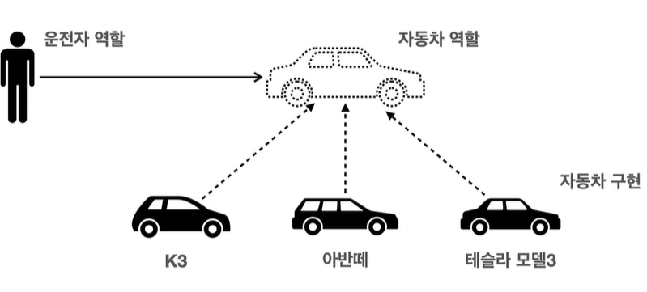

- 클라이언트의 변경없이 새로운 기능을 변경, 추가,삭제 할 수 있다.
  - 즉 운전자는 모든 자동차를 운전할 수 있다. 라는 개념 
- 역할은 구현의 내부 구조를 알 필요가 없다.

##### 역할과 구현의 분리
- 역할과 구현으로 구분하면 세상이 단순해지고, 유연해지며 변경도 편리해 진다.
- 장점
  - 클라이언트는 대상의 역할만 알면 된다.
  - 클라이언트는 구현 대상의 내부 구조를 몰라도 된다.
  - 클라이언트는 구현 대상의 내부 구조가 변경되어도 영향을 받지 않는다..
  - 클라이언트는 구현 대상 자체를 변경해도 영향을 받지 않는다.

##### 역할과 구현의 분리 (자바언어)
- 자바 언어의 다형성을 활용
  - 역할 = 인터페이스
  - 구현 = 인터페이스를 구현한클래스, 구현 객체
- 객체를 설계할 때 역할과 구현을 명확히 분리
- 객체 설계시 역할을 먼저 부여하고, 그 역할을 수행하는 구현 객체 만들기 (interface -> class)

##### 객체의 협력이라는 관계부터 생각
- 혼자 있는 객체는 없다.
- 클라이언트: 요청, 서버: 응답
- 수만은 객체 클라이언트와 객체 서버는 서로 협력 관계를 가진다.

##### 다형성의 본질
- 인터페이스를 구현한 객체 인스턴스를 실행 시점에 유연하게 변경할 수 있다.
- 다형성의 본질을 이해하려면 협력이라는 객체 사이의 관계에서 시작해야한다.

<b style='color=red'>즉. 인터페이스를 안정적으로 잘 설계하는 것이 중요하다</b>

##### 스프링과 객체지향
- 다형성이 가장 중요하다
- 스프링은 다형성을 극대화해서 이용할 수 있게 도와준다.
- 스프링에서 이야기하는 IoC, DI는 다형성을 활용해서 역활과 구현을 편리하게 다룰 수 있도록 지원한다.

#### 좋은 객체 지향 설계의 5가지 원칙
- SRP (단일 책임의 원칙)
  - 한 클래스는 하나의 책임만 가져야 한다
  - 책임의 범위는 추상적으로 범위는 개발자가 정할 수 있다.
    - 너무 작으면 파일이 많이 생성되고 너무 크면 유지보수가 힘들어짐
  - 중요한 기준은 변경읻. 변경이 있을때 파급 효과가 적으면 단일 책임 원칙을 잘 따르는것
- OCP (개방-폐쇄 원칙)
  - 소프트웨워 요소는 확장에는 열려있으나 변경에는 닫혀 있어야 한다.
  - 다형성 (interface-class)
  - 구현 객체를 변경하려면 클라이언트 코드를 변경해야 한다. 이는 OCP원칙을 위반한다.
  - 이 원칙을 지키려면 객체를 생성하고, 관계를 맺어주는 별도의 조립, 설정자가 필요하다.
- LSP (리스코프 치환 원칙)
  - 프로그램의 객체는 프로그램의 정확성을 깨뜨리지 않으면서 하위 타입의 인스턴스로 바꿀 수 있어야 한다.
  - 다형성에서 하위 클래스르는 인터페이스 규약을 지켜야 한다.    인터페이스의 의도 대로 구현체가 구현되어야 한다.이는 단순히 컴파일 성공 여부를 넘어서는 것을 의미한다.
- ISP (인터페이스 분리 원칙)
  - 특정 클라이언트를 위한 인터페이스 여러 개가 범용 인터페이스 하나보다 낫다.
    - 자동차 인터페이스 = 운전 인터페이스 + 정비 인터페이스
    - 사용자 인터페이스 = 운전자 인터페이스 + 정비사 인터페이스 
  - 인터페이스를 분리하는 것으로 역활이 조금 더 명확해 지고 대체 가능성이 높아 진다.
- DIP (의존관계 역전 원칙)
  - 구현체 보다는 인터페이스에 의존해야 한다.
    - 의존한다는 의미는 객체가 해당 기능을 전부 다 알고 있다는 의미다.
    - Interface interface = new class(); 는 DIP를 위반하고 있는것이다.

#### 객체 지향 설계와 스프링
- 모든 설계에 역활과 구현을 분리
- 이상적으로는 모든 설계에 인터페이스를 부여하는 것이 좋다.
- 실무 고민
  - 추상화 라는 비용이 생긴다. 코드를 찾아볼때 구현 클래스에 접근하기 위해 interface->class 순으로 접근할 수 밖에 없다.
  - 따라서 확장할 가능성이 없으면, 바로 구현클레스를 사용하는것이 좋다.

### 스프링 핵심 원리 이해 1 - 예제 만들기

#### 회원 서비스
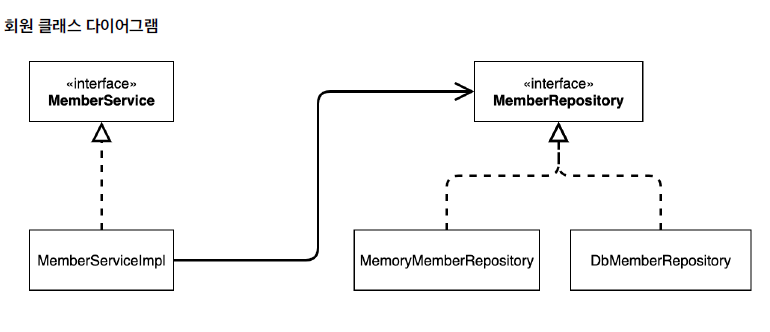
```java
public class MemberServiceImpl implements MemberService{
  private final MemberRepository memberRepository = new MemoryMemberRepository(); 

  @Override
  public void join(Member member) {
    memberRepository.save(member);
  }

  @Override
  public Member findById(Long id) {
    return memberRepository.findById(id);
  }

}
```
- 위 코드에서 문제는 MemberServiceImpl는 MemberRepository와 MemorymemberRepository에 의존한다는 것
- 즉 추상화(interface)에도 의존하고 구체화(class)에도 의존 한다는 것이 문제다.(DIP위반)
#### 주문 서비스
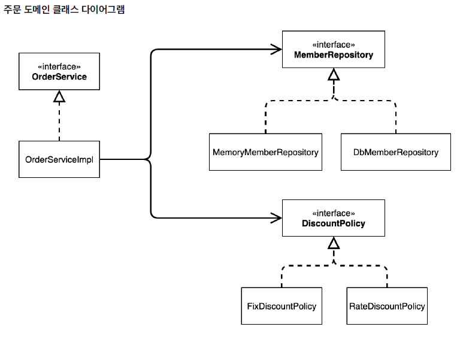

### 스프링 핵심 원리 이해 2 - 객체 지향 원리 적용

- OrderServiceImpl에서 인스턴스를 변경해 주는것으로 할인 정책을 변경할 수 있다.
 
```java
//private final DiscountPolicy discountPolicy = new FixdiscountPolicy();
private final DiscountPolicy discountPolicy = new RateDiscountPolicy();
```
- 회원서비스와 동일하게 문제가 발생한다.
  - 역활과 구현을 분리했나? -> ok
  - 다형성을 활용하고 인터페이스와 구현 객체를 분리했나? -> ok
  - OOP 원칙을 충실하게 준수 했나? -> no
    - DIP 위반 : 클래스 의존 관계를 분석해 보면, 추상 클래스(interface) 뿐만 아니라 구현 클래스(class)에도 의존하고 있다. -> OrderServiceImpl 에서 interface와 class에 접근했다.
    - 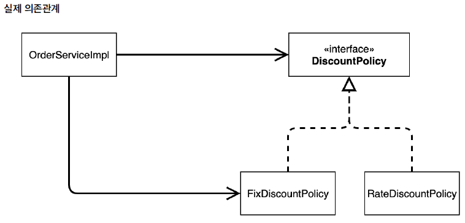
    - OCP 위반 : 클라이언트 변경 없이 확장 할 수 있어야 한다. -> 하지만 우리는 클라이언트에서 인스턴스를 변경하는 과정을 거쳤다
    - 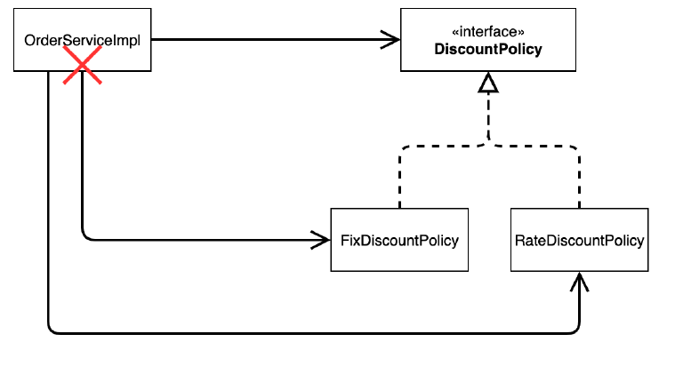
  
- 해결 방법은?
```javaprivate DiscountPolicy discountPolicy;```
  - 위와 같은 방법을 사용하면 구현체에는 의존하지 않지만 NPE가 발생한다.
  - 즉 제 3자가 와서 discountPolicy에 구현체를 넣어줘야 한다.

#### 관심사의 분리
- DIP를 지키기 위해서는 제 3자가 와서 discountPolicy에 구현체를 넣어줘야 한다.
- 그 역활을 AppConfig가 한다.
  - 구현체 (OrderServiceImpl)
  ```java
  private final MemberRepository memberRepository;
  private final DiscountPolicy discountPolicy; 
  
  public OrderServiceImpl(MemberRepository memberRepository, DiscountPolicy discountPolicy) { 
    this.memberRepository = memberRepository; 
    this.discountPolicy = discountPolicy;
  }
  ```
  - AppConfig (제 3자)
  ```java
  public OrderService orderService() {
      return new OrderServiceImpl(new MemoryMemberRepository(), new FixdiscountPolicy()); 
  }
  ```
- OrderServiceImpl는 더이상 구현체에 의존하지 않는다.
- 그저 추상 클래스만 의존하고 있을 뿐이다.
- OrderServiceImpl 입장에서 보면 어떤 구현체가 들어올지는 모른다.
- 어떤 구현체가 들어갈지는 AppConfig (제 3자)에 의해서 들어간다.
- 즉, OrderServiceImpl는 의존 관계(역활)에 대한 고민은 두고 실행하는 것에 집중할 수 있다. 
#### AppConfig 리팩터링
```java
public class AppConfig {

    public MemberService memberService() {
        return new MemberServiceImpl(memberRepository());
    }

    private MemberRepository memoryMemberRepository() {
        return new MemoryMemberRepository();
    }

    public OrderService orderService() {
        return new OrderServiceImpl(memoryMemberRepository(), discountPolicy());
    }

    private DiscountPolicy discountPolicy() {
        return new FixdiscountPolicy();
    }

}
```
- 이렇게 변경을 하면 추상클래스가 어떤 구현 클래스를 사용하는지 한눈에 알아 볼 수 있다.
- MemberRepository의 구현체로 MemoryMemberRepository를 사용하며
- DiscountPolicy의 구현체로 FixedDiscountPolicy를 사용한다.
- 만약 할인 정책이 변경된다 하면 discountPolicy() 함수의 return 부분만 변경해 주면 된다.
  - return new FixedDiscountPolicy(); -> return new RateDiscountPolicy();
#### 프레임워크 vs 라이브러리
- 내가 작성한 코드의 제어권이 나에게 없는 경우 : 프레임워크
  - JUnit의 경우
  - @Test 애노테이션을 사용하여 test code를 작성한다.
  - 이때 우리는 test의 라이프 사이클을 위한 어떤 객체를 생성하여 사용하지 않는다.
  - JUnit이 알아서 @BeforeEach와 같은 애노테이선을 통해서 알아서 동작한다.
  - 이것이 프레임워크의 하나의 예라고 할 수 있다.
- 내가 작성한 코드의 제어권이 나에게 있는 경우 : 라이브러리
  - PageNation의 경우
  - 내가 PageNation을 사용한다 하면 build.gradle에 dependency를 추가하고,
  - 인스턴스를 생성해서 상세한 설정을 진행한다.
  - 이것이 라이브러리다.
- 즉, 제공하는 것이 하나의 틀을 제공하냐, 하나의 방법을 제공하냐 에서 차이가 있다.
#### 의존관계 주입 : 정적인 클래스의 의존관계 vs 동적인 클래스의 의존관계
- 정적인 클래스의 의존관계
  - 코드로 바로 확인 할 수 있다
  - ex) Member member = new Member();
  - implement DiscountPolicy;
- 동적인 클래스의 의존 관계
  - 실핼을 시켰을때 의존 관계를 확인 할 수 있는 경우
#### Spring을 이용한 DI
- 스프링을 이용해서 DI를 하기 위해서는 스프링이 제공하는 애노테이션을 이용해야 한다.
- IoC container에 Bena을 등록하기 위해서는 AppConfig class에 @Configuration을 부여하고
- Bean을 등록하는 객체는 @Bean을 부여하면 된다.
```java
@Configuration
public class AppConfig {

    @Bean
    public MemberService memberService() {
        return new MemberServiceImpl(memoryMemberRepository());
    }

    @Bean
    public MemberRepository memoryMemberRepository() {
        return new MemoryMemberRepository();
    }
}
```
- main에서 IoC 컨테이너에 있는 Bean을 사용할 때에는 ApplicaationContext.class를 이용한다.
```java
    ApplicationContext applicationContext = new AnnotationConfigApplicationContext(AppConfig.class);
    MemberService memberService = applicationContext.getBean("memberService", MemberService.class);
    OrderService orderService = applicationContext.getBean("orderService", OrderService.class);
```
- 위와 같은 방법을 사용하면 IoC를 이용한 DI를 진행할 수 있다.
- 문제는 이전에 사용했던 AppConfig.class를 main에서 객체로 생성하여 사용하는 방법이 더욱더 쉬운 방법이라는 것이다.

#### 스프링 컨테이너와 스프링 빈
##### 스프링 컨테이너 생성과정
1. 스프링 컨테이너 생성 
   1. ApplicationContext를 스프링 컨테이너라고 할 수 있는데 이 추상클래스를 호출하는 것으로 스프링 컨테이너가 생성된다.
   2. 이때 구현체의 생성자의 파라미터로 해당 bean을 생성할 클래스를 인자로 넣어주면 해당 클래스의 bean을 생성할 수 있다.
2. Bean 생성
   1. Bean의 default name은 method name으로 지정되며 @bean(name="[name]")으로 Bean name을 지정할 수 있다.
3. 의존관계 설정
   1. 설정 정보를 참고해서 의존관계를 설정한다.(※자바코드를 호출하는 것 같지만 차이가 있음)
   2. Bean이 생성되면 자동적으로 의존관계가 설정이 된다.
      1. 만약 자바 코드로 스프링 빈을 등록하는 경우 의존 관계의 설정은 생성자를 호출하면서 의존관계도 설정이 된다.

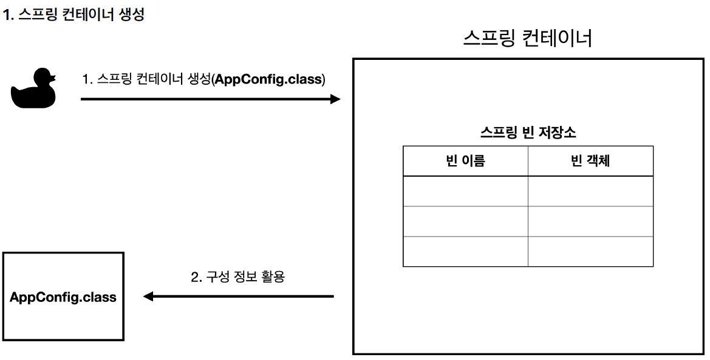
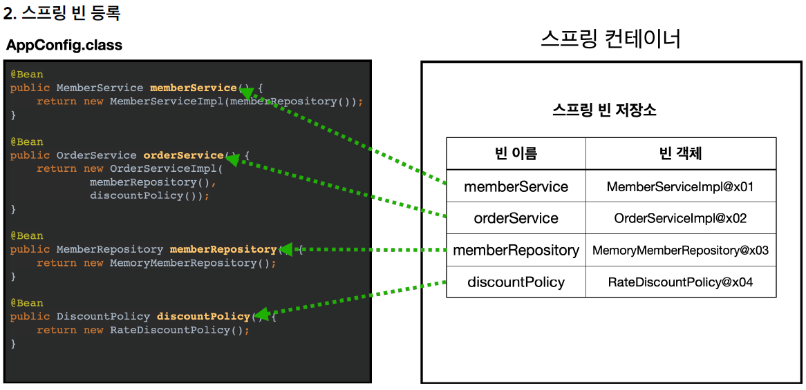
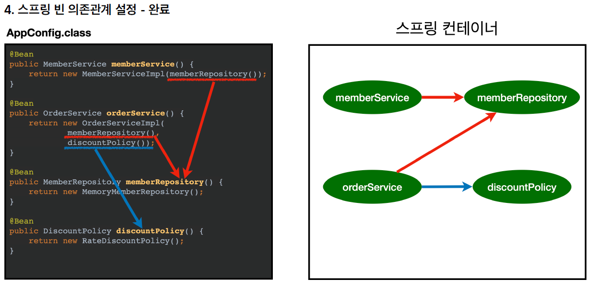

#### Exception Test
```java
    @Test
    @DisplayName("해당하는 이름으로 조회했는데 없는 경우")
    void findBeanByNameNotFound() {
        assertThrows(NoSuchBeanDefinitionException.class,
                () -> ac.getBean("memberservice", MemberService.class));
    }
```

### 싱글톤 컨테이너
#### 기존 코드의 문제점은 뭐가 있을까?
- 하나의 주문이 들어오면 파생되는 많은 객체가 만들어짐 == TPS가 높으면 그만큼 객체의 수가 많아짐
  - 이걸 해결하기 위해서는 하나의 객체를 생성하고 그것을 공유하는 것이 유리하다.
  - 이때 사용하는 것이 싱글톤 패턴이다.
```java
    private static final SingletonService getInstance = new SingletonService();

     public static SingletonService getInstance(){
         return getInstance;
     }

     private SingletonService() {
     }
```
- 위 코드와 같이 생성자를 부를 수 없도록 접근제어를 private로 막으면 singletonService의 생성자를 부를 수 있는 방법은
- getInstance를 호출하는 메서드를 사용하는 방법 뿐이다.

#### 싱글톤의 문제점
- 각 클래스마다 기본적으로 들어가는 코드가 있음...
- 의존관계상 보면 추상체에 의존하지 않는다.
- 유연한 테스트 불가능
- 자식클래스를 만들기 어렵다.
- 내부 속성을 변경하거나 초기화 하기 어렵다.
- 결론적으로 유연성이 떨어진다.

#### 싱글톤 컨테이너


- 위 그림에서 보면 스크링 컨테이너에 빈을 추가하고 빈을 사용할 때에는 해당 객체를 사용한다.
- 즉, 싱글톤 처럼 한번 생성한 인스턴스를 계속해서 사용하는 것과 같은 의미를 지닌다.
- 따라서, 스프링 컨테이너는 싱글톤 컨테이너 역할을 지니고 있다.

#### 싱글톤 방식의 주의점
- 무상태로 설계해야 한다
  - 특정 클라이언트에 의존적인 필드가 있으면 안된다
  - 특정 클라이언트가 값을 변경할 수 있는 필드가 있으면 안된다.
  - 가급적 읽기만 해야한다.
  - 필드를 사용하기 보다는 공유되지 않는, 지역변수, 파라미터, ThreadLocal을 사용해야 한다.
- 스프링 빈의 필드에 공유값을 설정하면 큰 장애가 발생 할 수 있다.
##### 뭐가 문제일까?
- StatefulService.class에서 보면 필드 변수가 선언되어 있다.
- 클라이언트에서 사용할때 싱글톤이면 인스턴스가 하나임으로 필드 변수가 모든 클라이언트에서 공유가 된다.
- 이때 Thread A와 Thread B에 해당 필드 변수를 초기화 하는 코드가 있으면 문제가 발생할 수 있다.
- 따라서 stateless하게 구현해야 한다.
##### 어떻게 stateless하게 구현할까?
- 필드 변수를 삭제하면 된다.
```java
    public int order(String name , int price){
        System.out.println("name = " + name + " price = " + price );
        return price;
    }
```
##### @Configuration과 싱글톤
- ConfigurationSingletonTest.class 에서 configurationTest()를 보면 AppConfig.class의 memberRepository.class를 3번 호출한다.
- 근데 java code를 보면 new Repository를 3번 하기 때문에 싱글톤으로 작동이 되면 안된다.
- configurationTest()를 보면 new Repository는 같은 인스턴스인것을 확인 할 수 있다.
- 즉, @Configuration 애노테이션이 하나의 인스턴스를 호출하도록 해준다는 의미를 지닌다.
##### @Configuration은 어떻게 싱글톤을 보장하나?
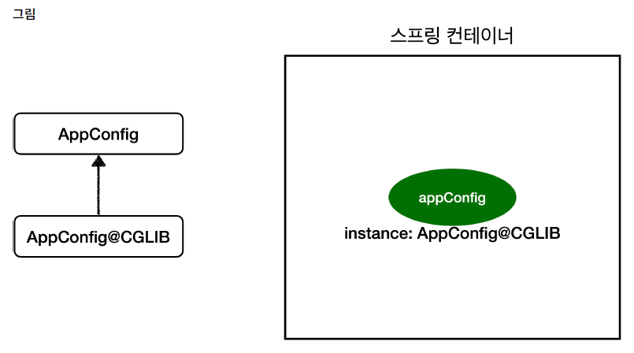

- @Configuration이 있는 class를 보면 CGLIB이라는 단어가 보인다.
- 즉, @Configuration이 바이트 코드를 조작해 싱글톤을 보장해 주는 것이다. 이때 바이트코드를 조작하는 라이브러리가 CGLIB이다.
- 따라서 @Configuration이 없어진다면 바이트 코드를 조작하지 못함으로 순수 java code로 인스턴스를 부여하게 된다.
- 즉, 싱글톤이 보장되지 않기 때문에 새로운 인스턴스를 생성해서 적용한다.

### 컴포넌트 스캔
- 기존 과정을 보면 @Bean으로 계속 bean으로 등록해 주고 의존 관계도 수동으로 이어 줘야 했다.
- 만약 class가 많아지면 그만큼 많은 시간이 소요 될 것이다.
- 이제는 @Component와 @Autowired로 DI를 편하게 할 수 있다.
#### 빈 등록과 DI
- Bean으로 등록하기 위해서는 @Component를 사용하면 빈으로 등록할 수 있다.
- DI를 하기 위해서는 @AutoWired를 사용해서 의존 관계를 설정할 수 있다.

```java
@Component("memberService")
public class OrderServiceImpl implements OrderService{

    @Autowired
    public OrderServiceImpl(MemberRepository memberRepository, DiscountPolicy discountPolicy) {
        this.memberRepository = memberRepository;
        this.discountPolicy = discountPolicy;
    }
}
```
#### ComponentScan의 동작방법
1. @ComponentScan이 @Component가 붙은 class를 모두 bean으로 등록한다
   1. 이때 Bean name은 class의 이름을 사용하되 가장 앞자리는 소문자로 사용된다
   2. 만약 Bean name을 지정하고 싶은 경우 @Component("[name]")으로 지정해 줄 수 있다.
2. @Autowired를 만나면 해당하는 Bean을 찾아서 DI를 해준다
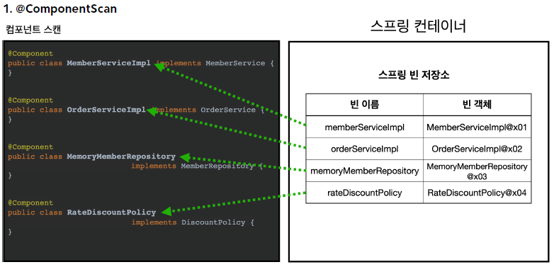
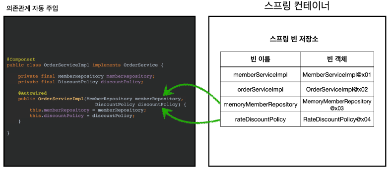
#### ComponentScan
- Scan의 시작 위치를 적용할수 있다
  - @Componentscan(basePackages = "hello.core.member")
  - @Componentscan(basePackagesClass = "hello.core.member.")
- 관례적으로 프로젝트의 최상단에서 componentScan을 하는것으로 한다.
  - SpringbootApplication에 보면 @ComponentScan이 있다.
#### filter
- includeFilters : 스캔 대상을 추가로 지정
- excludeFilters : 스캔 대상에서 제외
```java
    @Configuration
    @ComponentScan(
            includeFilters = @ComponentScan.Filter(type = FilterType.ANNOTATION, classes = MyIncludeComponent.class),
            excludeFilters = @ComponentScan.Filter(type = FilterType.ANNOTATION, classes = MyExcludeComponent.class)
    )
    static class ComponentFilterAppConfig {

    }
```
#### 중복 등록과 충돌
1. 자동 빈 등록 vs 자동 빈 등록 : @component([name])이 중복으로 선언되어 있는 경우 -> Exception 발생 
2. 수동 빈 등록 vs 자동 빈 등록 : 수동 빈 등록이 우선권을 가진다.
   1. 최근 스프링 부트는 수동으로 빈을 등록하는 경우 중복된 bean name이 있는 경우 시작이 안되도록 변경해 두었다.

### 의존관계 자동 주입
#### 의존관계 주입방법
1. 생성자 주입
```java
    private final DiscountPolicy discountPolicy;
    private final MemberRepository memberRepository;

    @Autowired
    public OrderServiceImpl(MemberRepository memberRepository, DiscountPolicy discountPolicy) {
        this.memberRepository = memberRepository;
        this.discountPolicy = discountPolicy;
    }
```
   - 생성자를 호출하는 시점에서 딱 1번만 호출되는 것이 보장된다.
   - 불편, 필수 의존관계에 사용
   - 생성자가 1개인 경우 자동으로 @Autowired가 된것으로 간주한다.
2. setter 주입(수정자 주입)
```java
private DiscountPolicy discountPolicy;
    private MemberRepository memberRepository;

    @Autowired
    public void setMemberRepository(MemberRepository memberRepository) {
        this.memberRepository = memberRepository;
    }
    @Autowired
    public void setDiscountPolicy(DiscountPolicy discountPolicy) {
      this.discountPolicy = discountPolicy;
    }
```
        - 선택, 변경 가능성이 있는 의존관계에 사용
   - 자바 빈 프로퍼티 규약의 수정자 메서드 방식을 사용하는 방법이다.
3. 필드주입
```java
    @Autowired  
    private DiscountPolicy discountPolicy;
    @Autowired  
    private MemberRepository memberRepository;
```
  - 권장하지는 않는다.
  - DI 프레임워크가 없으면 아무것도 할 수 없다
4. 일반 메서드 주입
```java
    private DiscountPolicy discountPolicy;
    private MemberRepository memberRepository;

    @Autowired
    public void init(MemberRepository memberRepository, DiscountPolicy discountPolicy){
        this.memberRepository = memberRepository;
        this.discountPolicy = discountPolicy;
    }
```
  - 한번에 여러 필드를 주입 받을 수 있다.
  - 일반적으로 잘 사용하지는 않음

<b>생성자 주입은 bean을 등록하면서 DI를 동시에 하지만 setter주입은 bean을 등록한 이후에 DI를 진행한다.</b>
#### 옵션처리 - 주입할 bean이 없어도 동작하게 하는 방법
- @Autowired(required = true) 인데 이걸 false로 변경하면 bean이 없어도 가능하다.
``` java
    @Test
    void AutowiredOption(){
        ApplicationContext ac = new AnnotationConfigApplicationContext(TestBean.class);

    }

    static class TestBean{

        @Autowired(required = false)
        public void setNoBean(Member member){
            System.out.println("member = " + member);
        }

        @Autowired
        public void setNoBean2(@Nullable Member member2){
            System.out.println("member2 = " + member2);
        }

        @Autowired
        public void setNoBean3(Optional<Member> member3){
            System.out.println("member3 = " + member3);
        }
    }
```
- 위 코드를 통해 bean이 없어도 DI가 동작할 수 있도록 할 수 있다.
- @Autowired(required = false)
  - 해당 메서드는 실행 자체가 안된다.
- @Nullable 
  - 메서드는 실행이 되지만 null로 DI가 진행된다.
- Optional
  - 메서드는 실행이 되고 Optional.empty로 DI가 된다.
#### 생성자 주입을 사용해야 하는 이유
- 불변
  - 대부분의 의존관계는 한번 일어나면 애플리케이션이 종료될때 까지 변경할 일이 없어야 한다.
  - setter주입을 하게 되면 public을 사용해야 한다.이는 누군가 변경할 여지를 줄 수 있다.
  - 생성자 주입은 한번만 실행되기 때문에 변경이 불가능 하다.
- 누락
  - setter주입을 하는 경우 runtimeError가 발생할 수 있다.
  - 하지만 생성자 주입을 하는 경우 compileError가 발생한다.
  - final 키워드를 사용할 수 있으며 불변을 강제 할 수 있다.
#### lombok을 이용한 DI
- 필드가 final로 되어 있으면 생성자주입 할 때 필수로 주입이 되어야 한다.
- 생성자 주입시 생성자메서드가 단일이면 @Autowired를 생량할수 있다.(의존관계 주입방법 생성자 주입 참고)
- Lombok의 @RequiredArgsConstructor를 사용하면 생성자를 만들 수 있다.
- 즉, final을 가지고 있는 필드 변수를 가진 생성자를 만들고 @Autowired는 자동으로 생략되니 간단하게 DI를 진행할 수 있다.
#### 자동 의존관계주입을 사용하는데 만약 bean이 두개 이상 있는 경우
```java
@Component
class RateDiscountPolicy implements DiscountPolicy{
    
}
@Component
class FixedDiscountPolicy implements DiscountPolicy{
    
}
```
- 위와 같이 있는 경우 의존관계 주입을 할때 class type만 인수로 사용하기 때문에 DiscountPolicy의 bean이 2개로 잡힌다.
- 이것을 해결하는 방법은 다음과 같다
- 수동주입
- 자동주입
  - Autowired 필드 명 매칭 
    ```java
        this.discountPolicy = fixediscountPolicy;
    ```
  - @Quilifier 끼리 매칭 : 추가적인 이름 부여(변경하는 것이 아님)
    ```java
      @Quilifier("mainDiscountPolicy")
      class ReatDiscountPolicy{}
      
      class OrderserviceImpl implement OrderService{
          @Autowired
          public OrderServiceImpl(MemberRepository memberRepository, @Qualifier("mainDiscountPolicy") DiscountPolicy fixediscountPolicy) {
          this.memberRepository = memberRepository;
          this.discountPolicy = fixediscountPolicy;
          }  
        }
  - @Primary 사용 : 우선순위를 지정 
- @Quilifer, @Primary 활용
  - 기본적으로 주로 사용하는 것을 @Primary로 지정해 두고 추가적으로 변경점이 있는 사용은 @Quilifer를 사용한다.
- @Quilifer, @Primary 우선순위
  - 만약 두개 다 있는 경우 @Quilifer가 우선순위를 가지고 동작 한다.

#### 해당 타입의 모든 빈을 조회하는 방법 (AllBean.test)
- 클라이언트가 할인의 종류를 선택하는 경우 모든 해당 타입의 모든 빈을 가져와야 한다.
```java
    static class  DiscountService{
        private final Map<String, DiscountPolicy> policyMap;
        private final List<DiscountPolicy> discountPolicies;

        @Autowired
        public DiscountService(Map<String, DiscountPolicy> policyMap, List<DiscountPolicy> discountPolicies) {
            this.policyMap = policyMap;
            this.discountPolicies = discountPolicies;
            System.out.println("policyMap = " + policyMap);
            System.out.println("discountPolicies = " + discountPolicies);
        }

        public int discount(Member member, int i, String discountPolicies) {
            DiscountPolicy discountPolicy = policyMap.get(discountPolicies);
            int discount = discountPolicy.discount(member, i);
            return discount;
        }
    }
```
- AnnotationConfigApplicationContext의 생성자에 파라미터를 지정한다.
  ```java
        AnnotationConfigApplicationContext ac = new AnnotationConfigApplicationContext(AutoAppConfig.class,DiscountService.class);
- 이렇게 되면 container에 등록이 될때 제네릭에 해당하는 class type의 Bean이 map과 list에 등록된다.
#### 실무에서는 자동,수동 주입을 어떻게 사용할까?
- 업무 로직 빈 : 웹을 지원하는 컨트롤 러, 핵심 비즈니스 로직이 있는 서비스, 데이터 계층의 로직을 처리하는 리포지토리등이 모두 업무 로직이다.
  - 유사한 패턴이 있는 경우, 로직의 수가 굉장히 많은경우 자동 빈 등록을 사용하는 것이 좋다. 
- 기술 지원 빈 : 기술적인 문제나 공통 관심사(AOP)를 처리할 때 주로 사용한다. 데이터베이스 연결이나, 공통 로그 처리 처럽 업무 로직을 지원하기 위한 하부기술이나 공통 기술들이다.
  - 로직의 수는 적지만 미치는 영향이 광범위 한경우, 적용 여부 확인이 원활하지 않는 경우 수동으로 빈 등록을 해주는 것이 좋다.
- 비즈니스 로직에서 수동 빈 등록을 사용하는 경우가 있다.
  - DiscountService()은 무엇이 빈으로 등록되어 있는지 확인하기 힘듬
  - class type으로 등록된 모든 빈을 찾아서 동적으로 사용하는 경우
  - 차라리 수동으로 빈 등록을 하거나 특정 패키지에 묶는 방법이 편하다.
### 빈 생성주기 콜백 (package : lifecycle)
- 빈의 라이프 사이클은 다음과 같다
  1. 스프링 컨테이너 생성
  2. 스프링 빈 생성
  3. 빈 의존관계 주입
  4. 초기화 콜백
  5. 사용
  6. 소멸전 콜백
  7. 스프링 종료
- 따라서 bean을 호출했을때 rul이 없는 것은 당연하다.
- 그러면 spring은 어떻게 url이 있는 상태로 bean을 사용하는 것일까?를 생각해 보면 초기화 콜백을 사용해야 한다는 결론이 나온다.
- 스프링이 지원하는 빈 생성주기 콜백은 3가지가 있다.
  - 인터페이스 (InitializingBean, DisposableBean)
  - 설정 정보에 초기화 메서드, 종료 메서드 지정
  - @PostConstruct, @PreDestory 애노테이션 지원

>(참고)객체의 생성과 초기화를 분리하자
생성자는 필수정보를 받고 메모리를 할당해서 객체를 생성하는 책임을 가진다. 반면에 초기화는 생성된 값을 사용하는 무거운 작업을 한다.
따라서 생성자 안에서 무거운 작업을 하는 것 보다는 초기화 작업만 하는 것이 유지보수 관점에 유리하다.

1. InitializingBean, DisposableBean사용
```java
    (InitializingBean)
    @Override
    public void afterPropertiesSet() throws Exception {
        //의존 관계 주입이 끝난 시첨
        connect();
        call("초기화 연결 메시지");
    }
    (DisposableBean)
    @Override
    public void destroy() throws Exception {
        disConnect();
    }
```
  - 단점
    - 인터페이스는 스프링 전용 인터페이스로서 스프링에 의존 한다.
    - 초기화, 소멸 메소드 명을 변경할 수 없다.(오버라이딩 했음)
    - 내가 코드를 고칠수 없는 외부 라이브러리에 적용할 수 없다.
2. 설정 정보에 초기화 메서드, 종료 메서드 지정
```java
    (BeanLifecycleTest.java)
    @Bean(initMethod = "init" , destroyMethod = "destroy")
    public NetworkClient networkClient(){
        NetworkClient networkClient = new NetworkClient();
        networkClient.setURL("http://naver.com");
        return networkClient;
    }
```
  - InitializingBean, DisposableBean의 단점을 어느정도 해결 가능
  - destoryMethod에는 추론기능이 있다.
    - 이 추론 기능은 close, shutdown이라는 함수명을 가지고 있으면 자동으로 호출해 준다.
    - 따라서 해당 이름으로 종료 로직을 넣어주면 자동으로 호출해 줄 수 있다.
3. @PostConstruct, @PreDestory 애노테이션 지원
```java
    @PostConstruct
    public void init() throws Exception {
        //의존 관계 주입이 끝난 시첨
        connect();
        call("초기화 연결 메시지");
    }

    @PreDestroy
    public void destroy() throws Exception {
        disConnect();
    }
```
- 단점
  - 외부 라이브러리에는 사용할 수없다...
  - 따라서 외부 라이브러리에 적용하기 위해서는 @Bean 설정정보에 초기화, 종료 메서드를 지정해 주는 방식을 사용한다.